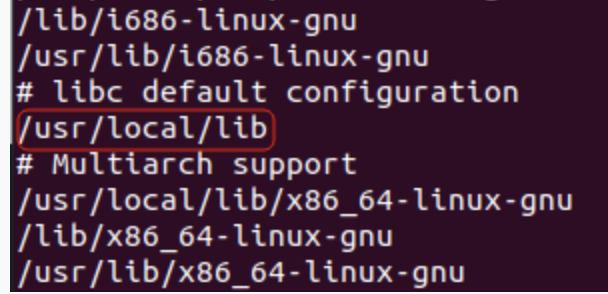

# Installation-OpenCV

[내가 참고하고 싶은 Ubuntu 20.04에 OpenCV 4.4.0 설치방법](https://velog.io/@minukiki/Ubuntu-20.04에-OpenCV-4.4.0-설치)

- 컴파일 명령어

```bash
g++ main main.cpp $(pkg-config opencv4 --libs --cflags)
```

- 이전에 설치되어 있는 OpenCV 삭제하고 설치해야함.

```bash
pkg-config --modversion opencv
```

- OpenCV 설정 파일을 포함해서 패키지를 삭제

```bash
sudo apt-get purge libopencv* python-opencv
sudo apt-get autoremove
```

- 기존에 설치된 패키지들을 업그레이드

```bash
sudo apt-get update
sudo apt-get upgrade
```

```bash
sudo apt-get install build-essential cmake
sudo apt-get install pkg-config
sudo apt-get install libjpeg-dev libtiff5-dev libpng-dev
sudo apt-get install ffmpeg libavcodec-dev libavformat-dev libswscale-dev libxvidcore-dev libx264-dev libxine2-dev
sudo apt-get install libv4l-dev v4l-utils
sudo apt-get install libgstreamer1.0-dev libgstreamer-plugins-base1.0-dev
sudo apt-get install libgtk-3-dev
sudo apt-get install mesa-utils libgl1-mesa-dri libgtkgl2.0-dev libgtkglext1-dev
sudo apt-get install libatlas-base-dev gfortran libeigen3-dev
sudo apt-get install python3-dev python3-numpy

```

- **cmake**는 컴파일 옵셥이나 빌드된 라이브러리에 포함 시킬 OpenCV 모듈 설정등을 위해 필요

```bash
sudo apt-get install build-essential cmake
```

- **pkg-config**는 프로그램 컴파일 및 링크시 필요한 라이브러리에 대한 정보를 메타파일(확장자가 .pc 인 파일)로부터 가져오는데 사용

```bash
sudo apt-get install pkg-config
```

- 특정 포맷의 이미지 파일을 불러오거나 저장하기 위해 필요한 패키지 설치

```bash
sudo apt-get install libjpeg-dev libtiff5-dev libpng-dev
```

- 특정 코덱의 비디오 파일을 읽어오거나 저장하기 위해 필요한 패키지 설치

```bash
sudo apt-get install ffmpeg libavcodec-dev libavformat-dev libswscale-dev libxvidcore-dev libx264-dev libxine2-dev
```

- 리눅스에서 웹캠으로부터 실시간 비디오 캡처를 지원하기 위한 디바이스 드라이버와 API를 포함하는 Video4Linux 패키지 설치

```bash
sudo apt-get install libv4l-dev v4l-utils
```

- 비디오 스트리밍을 위한 GStreamer 라이브러리 설치

```bash
sudo apt-get install libgstreamer1.0-dev libgstreamer-plugins-base1.0-dev
```

- 뭐더라…

```bash
sudo apt-get install libgtk-3-dev
```

- OpenGL 지원하기 위해 필요한 라이브러리

```bash
sudo apt-get install mesa-utils libgl1-mesa-dri libgtkgl2.0-dev libgtkglext1-dev
```

- OpenCV 최적화를 위해 사용되는 라이브러리

```bash
sudo apt-get install libatlas-base-dev gfortran libeigen3-dev
```

- python3-dev 패키지는 OpenCV-Python 바인딩을 위해 필요한 패키지. Numpy는 매트릭스 연산등을 빠르게 처리할 수 있어서 OpenCV에서 사용

```bash
sudo apt-get install python3-dev python3-numpy
```

- 소스 코드를 저장할 임시 디렉토리를 생성하여 이동 후 진행

```bash
mkdir opencv
cd opencv
```

- OpenCV 4.4.0 소스코드를 다운로드 받아 압축을 풀어줌

```bash
wget -O opencv.zip https://github.com/opencv/opencv/archive/4.4.0.zip
unzip opencv.zip
```

- opencv_contrib(Extra modules) 소스코드를 다운로드 받아 압축을 풀어줌. 기본 모듈에서 빠진 모듈들과 SURF 등의 nonfree 모듈을 사용하기 위해 필요. SIFT는 OpenCV 4.4.0부터 Extra 모듈에서 기본 모듈로 옮겨짐.(Features에 대한 라이브러리)

```bash
wget -O opencv_contrib.zip https://github.com/opencv/opencv_contrib/archive/4.4.0.zip
unzip opencv_contrib.zip
ls
```

- opencv-4.4.0 디렉토리로 이동하여 build 디렉토리를 생성하고 build 디렉토리로 이동. 컴파일은 build 디렉토리에서 진행

```bash
cd opencv-4.4.0
mkdir bulid
cd bulid
```

- CMake 설치

```bash
sudo apt install cmake
```

- cmake를 사용하여 OpenCV 컴파일 설정을 해줌

```bash
cmake -D CMAKE_BUILD_TYPE=RELEASE -D CMAKE_INSTALL_PREFIX=/usr/local -D WITH_TBB=OFF -D WITH_IPP=OFF -D WITH_1394=OFF -D BUILD_WITH_DEBUG_INFO=OFF -D BUILD_DOCS=OFF -D INSTALL_C_EXAMPLES=ON -D INSTALL_PYTHON_EXAMPLES=ON -D BUILD_EXAMPLES=OFF -D BUILD_PACKAGE=OFF -D BUILD_TESTS=OFF -D BUILD_PERF_TESTS=OFF -D WITH_QT=OFF -D WITH_GTK=ON -D WITH_OPENGL=ON -D BUILD_opencv_python3=ON -D OPENCV_EXTRA_MODULES_PATH=../../opencv_contrib-4.4.0/modules -D WITH_V4L=ON  -D WITH_FFMPEG=ON -D WITH_XINE=ON -D OPENCV_ENABLE_NONFREE=ON -D BUILD_NEW_PYTHON_SUPPORT=ON -D OPENCV_SKIP_PYTHON_LOADER=ON -D OPENCV_GENERATE_PKGCONFIG=ON ../
```

- make 명령을 사용하여 컴파일(time 옵션으로 경과 시간 출력)

```bash
time make -j$(nproc)
```

- 컴파일 결과 설치

```bash
sudo make install
```

- /etc/ld.so.conf.d/ 디렉토리에 /usr/local/lib를 포함하는 설정파일이 있는지 확인

```bash
cat /etc/ld.so.conf.d/*
```



- /usr/local/lib을 찾은 경우나 못찾아서 추가한 작업을 한 경우 모두 컴파일시 opencv 라이브러리를 찾을 수 있도록 설정.

```bash
sudo ldconfig
```

- 

```bash
python3

import cv2
cv2.__version__
quit()
```


- OpenCV4.4에서 제공하는 예제 코드 실행

```bash
python3 /usr/local/share/opencv4/samples/python/facedetect.py --cascade "/usr/local/share/opencv4/haarcascades/haarcascade_frontalface_alt.xml" --nested-cascade "/usr/local/share/opencv4/haarcascades/haarcascade_eye_tree_eyeglasses.xml" /dev/video0
```

- 설치할 때 사용한 opencv 폴더 삭제

```bash
cd
rm -rf opencv
```